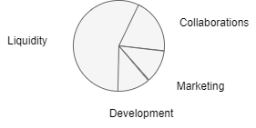

# Token Distribution

The total supply of the token is 100,000,000 $HENTAI

The token is allocated as follows:

* 10% Supply (10,000,000 $HENTAI) allocated to the Development wallet
* 10% Supply (10,000,000 $HENTAI) allocated to the Marketing wallet
* 20% Supply (20,000,000 $HENTAI) allocated to the Collaborations wallet
* 60% Supply (60,000,000 $HENTAI) allocated to the liquidity pool at launch

The wallet functionality is as follows:

The `Development` wallet is used for expanding Hentai Bot's functionality, as well as website updates and maintenance.

The `Marketing` wallet will be used to pay for listing fees as well as provide liquidity for new exchanges outside of Raydium. 
    * The team **will not** accept any marketing proposals from **any source**.

The `Collaborations` wallet is used to collaborate with Hentai artists to help bring more exposure to the token.

The remaining tokens will go towards `liquidity`